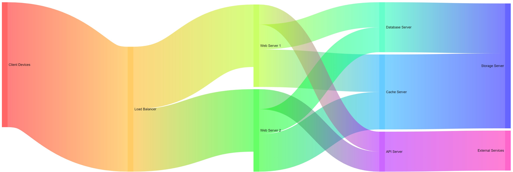

# BlazorSankey

## About

A sankey diagram component that can be used in Blazor applications. At the moment the implementation is very basic but should already be useful for some cases.



## How to use

The BlazorServerTest and BlazorWasmTest projecs include a sample - the usage should be straight forward:
- Add the NuGet package to your project (coming soon, for know please download the project)
- Place the SankeyDiagram component in your Blazor page
- Define your nodes and links
- Pass nodes and links to the component

Optionally
- Pass Width and Height parameters
- Pass event handlers to OnNodeClicked and OnLinkClicked if you want to react to clicks

```
@page "/"

@using Codeus.BlazorSankey
@using Codeus.BlazorSankey.Model;

<SankeyDiagram 
    Width="100%" 
    Height="402px" 
    Nodes="@nodes" 
    Links="@links" 
    OnNodeClicked="NodeClicked" 
    OnLinkClicked="LinkClicked" />

@code {
    private List<Node> nodes = new List<Node> {
        new Node(1, "Client Devices", fixedValue: 8000),
        new Node(2, "Load Balancer"),
        new Node(3, "Web Server 1"),
        new Node(4, "Web Server 2"),
        new Node(5, "Database Server"),
        new Node(6, "Cache Server"),
        new Node(7, "Storage Server"),
        new Node(8, "API Server"),
        new Node(9, "External Services")
    };

    private List<Link> links = new List<Link> {
        new Link(1, 2, 5000),
        new Link(2, 3, 2500),
        new Link(2, 4, 2500),
        new Link(3, 5, 1000),
        new Link(3, 6, 1500),
        new Link(4, 5, 1000),
        new Link(4, 6, 1500),
        new Link(5, 7, 2000),
        new Link(6, 7, 3000),
        new Link(3, 8, 800),
        new Link(4, 8, 800),
        new Link(8, 9, 1600)
    };
    
    private void NodeClicked(Node node)
    {
        Console.WriteLine($"Node {node.Name} clicked");
    }

    private void LinkClicked(Link link)
    {
        Console.WriteLine($"Link {link.pId} clicked");
    }
}
```
